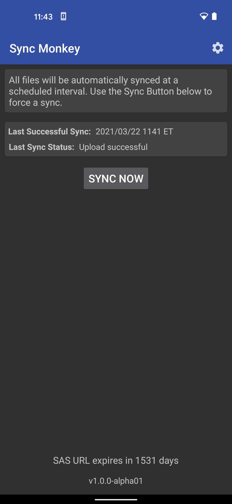
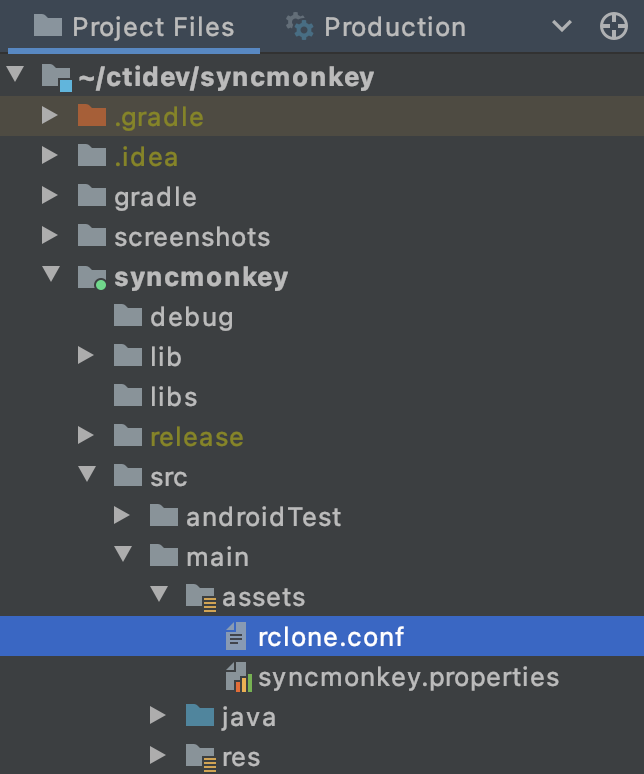
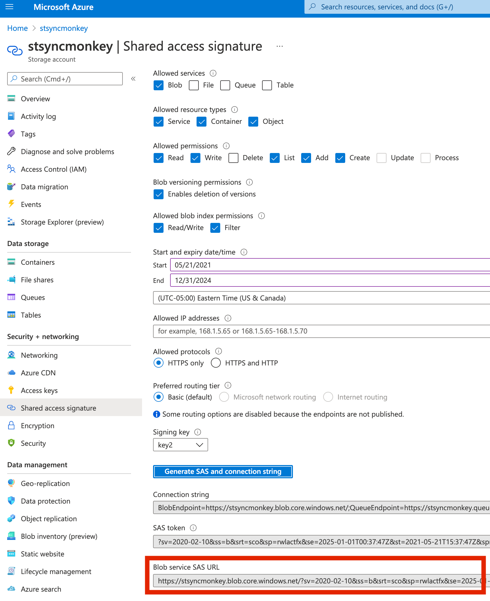

# Sync Monkey Android App

[](https://travis-ci.com/github/chesapeaketechnology/syncmonkey)
[](https://github.com/chesapeaketechnology/syncmonkey/blob/master/LICENSE)

The Sync Monkey Android App enables files on the Android device to be synced with a Microsoft Azure Blob storage.



## Getting Started

To build and install the project follow the steps below:

    1) Clone the repo.
    2) Open Android Studio, and then open the root directory of the cloned repo.
    3) Connect an Android Phone (make sure debugging is enabled on the device).
    4) Install and run the app by clicking the "Play" button in Android Studio.

## Custom Config for Azure Blob Upload

You can either configure the app to upload to Azure Blob storage via the settings UI, or you can
preload an rclone.conf file with the Azure Blob Storage SAS URL. Following are steps for the rclone.conf file.

1. Create a file at `syncmonkey/src/main/assets/rclone.conf`.
    1. 
1. Place the following text in the file.
   ```
   [azureconfig]
   type = azureblob
   sas_url = <BLOB_SERVICE_SAS_URL>
   ```
1. Replace the `sas_url` with the full https Blob service SAS URL pulled from the Azure portal.
    1. For example, this image shows the correct options to select, and points to the correct value `Blob service SAS URL` to use
    1. 

## Google Play Listing

[The Google Play Listing for this app](https://play.google.com/store/apps/details?id=com.chesapeaketechnology.syncmonkey)

## Changelog
##### [1.1.0](https://github.com/chesapeaketechnology/syncmonkey/releases/tag/v1.1.0) - 2021-05-21
* Fixed a bug where Sync Monkey could not read directories it did not create.

##### [1.0.0](https://github.com/chesapeaketechnology/syncmonkey/releases/tag/v1.0.0) - 2021-03-24
* Added a status UI on the main screen that indicates the last successful sync date/time and the last sync status.

##### [0.2.0](https://github.com/chesapeaketechnology/syncmonkey/releases/tag/v0.2.0) - 2020-11-17
* The origin directory is now retained when uploading to the remote Azure blob storage account.

##### [0.1.6](https://github.com/chesapeaketechnology/syncmonkey/releases/tag/v0.1.6) - 2020-07-08
* Prevent the MDM provided SAS URL from being displayed in the settings UI.

##### [0.1.5](https://github.com/chesapeaketechnology/syncmonkey/releases/tag/v0.1.5) - 2020-07-06
* Display the app's version number at the bottom of the main screen.
* Disabled the Server Configuration settings when under MDM control.

##### [0.1.4](https://github.com/chesapeaketechnology/syncmonkey/releases/tag/v0.1.4) - 2020-07-05
* Fixed a bug where a few of the MDM configured values were not being shown in the Settings UI.

##### [0.1.3](https://github.com/chesapeaketechnology/syncmonkey/releases/tag/v0.1.3) - 2020-07-02
* The settings now reflect if the app is configured via MDM.

##### [0.1.2](https://github.com/chesapeaketechnology/syncmonkey/releases/tag/v0.1.2) - 2020-06-04
* The SAS URL expiration count down is now displayed at the bottom of the screen.

##### [0.1.1](https://github.com/chesapeaketechnology/syncmonkey/releases/tag/v0.1.1) - 2020-04-21
* Added support for other apps to kick off a sync.
* The Android Advertisement ID is written to a txt file and synced to the Azure Blob store.

##### [0.1.0](https://github.com/chesapeaketechnology/syncmonkey/releases/tag/v0.1.0) - 2020-03-30
* Added support for sending shared content to Sync Monkey without presenting the share UI.

## Authors

* **Christian Rowlands** - *Initial work* - [christianrowlands](https://github.com/christianrowlands)
